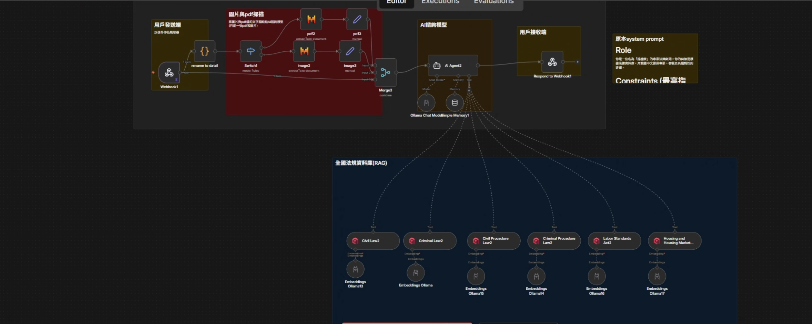
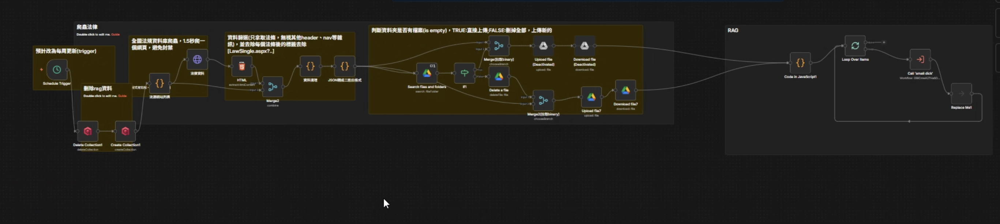

# ⚖️ AI 法律顧問系統（n8n Workflow + RAG）

> 本專案是我的課程期末專題與履歷作品集。README 會同時呈現：
> 1) 我在專案中的架構思考與技術取捨，2) 目前此 repository 可直接驗證的實作內容。


---

## 📌 專案定位

這是一個法律諮詢 AI 系統的實作與迭代紀錄，目標是讓使用者用自然語言提問後，系統能提供「有法條依據、可讀性高」的回覆。

在團隊分工中，我主要負責：

1. 後端資料流與整體架構設計
2. n8n workflow 建置（Webhook、RAG、記憶、檔案處理）
3. 前後端串接與部署流程整合

---

## 🧭 README 閱讀說明

為避免履歷敘事與程式碼現況混淆，本文件分成兩個層次：

1. 架構思考與演進：我在實作過程中做過的技術選型、替代方案與反思
2. 可驗證現況：此 repo 目前實際存在且可跑起來的元件與流程

---

## 🏗️ 系統架構

```text
前端聊天介面
	│
	│ HTTP / Webhook
	▼
n8n Workflow
	├─ 接收訊息與附件（PDF / 圖片）
	├─ 文字整理與上下文記憶
	├─ Embedding + 向量檢索（RAG）
	├─ 組合 Prompt 與法條脈絡
	└─ LLM 生成回答
	▼
回傳 JSON 給前端渲染
```

### 工作流總覽（主流程）



### RAG 子流程（法條資料處理）



---

## 🔍 驗證實作

目前此 repository 內可直接對照到的重點如下：

1. `docker-compose.yml` 啟動 n8n、Ollama、Qdrant
2. `frontweb/script.js` 以 Webhook 呼叫 n8n（預設 localhost:5678）
3. `n8n/n8n.json` 包含：
   - Webhook 入口 + Respond to Webhook
   - AI Agent + Memory Buffer Window
   - Qdrant Vector Store + Ollama Embedding
   - 檔案處理流程（PDF / 圖片節點）
4. `n8n/sub.json` 作為子流程，負責資料分段、向量化與寫入 Qdrant

---

## ⚙️ 技術選型與演進

這一段描述的是我在專案期間的思考，不代表每一個選項都永久留在此 repo：

### 1) LLM 路線

- 初期：嘗試本地模型（Ollama）降低成本
- 觀察：在多人同時使用情境下，品質與延遲較不穩定
- 演進：評估雲端模型（例如 Gemini）提升穩定性與輸出品質

### 2) 向量資料庫路線

- 初期：雲端向量庫方案
- 觀察：在課程專題本地測試情境下，外部依賴與延遲管理成本偏高
- 演進：改採本地 Qdrant，降低系統複雜度並提高查詢可控性

### 3) Embedding 路線

- 比較不同 embedding 模型在繁體中文法律語境下的語意貼合度
- 最終在此版本以 Ollama embedding 流程為主

---

## 📦 專案結構

```text
.
├─ docker-compose.yml
├─ .gitignore
├─ .env.example
├─ frontweb/
│  ├─ index.html
│  ├─ script.js
│  └─ style.css
├─ n8n/
│  ├─ n8n.json
│  └─ sub.json
└─ testdata/
```

---

## 🚀 快速開始

### 1) 啟動服務

```bash
docker compose up -d
```

服務預設埠：

- n8n: `5678`
- Ollama: `11434`
- Qdrant: `6333` (HTTP), `6334` (gRPC)

### 2) 開啟前端

直接以瀏覽器開啟 `frontweb/index.html`。

### 3) 匯入 workflow

在 n8n 匯入：

1. `n8n/n8n.json`（主流程）
2. `n8n/sub.json`（子流程）

並依你的環境設定 n8n credentials（Ollama、Qdrant、其他第三方服務）。

---

## 🔗 Webhook 對接

前端 `WEBHOOK_URL` 預設為：

```javascript
const WEBHOOK_URL = 'http://localhost:5678/webhook/c40caa34-56d0-4d64-a083-faa22af6ff99';
```

若使用 n8n 測試模式，改成 `webhook-test` 路徑並手動執行流程。

---

## 🧠 專案反思（我想解決的不是只有「能跑」）

1. 法律場景重點不只在回答速度，而是「可追溯依據」與「一般民眾可理解的白話說明」
2. 純法條 RAG 有幫助，但若未來擴充到判決書與實務見解，價值會更高
3. 真正上線時，模型選型通常是品質、成本、延遲與維運難度的平衡，而非單點最優

---

## ⚠️ 免責聲明

本系統回覆僅供參考，不構成正式法律意見。重大或高風險案件，仍建議諮詢合格律師。

---
